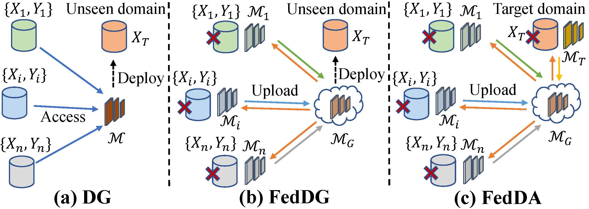
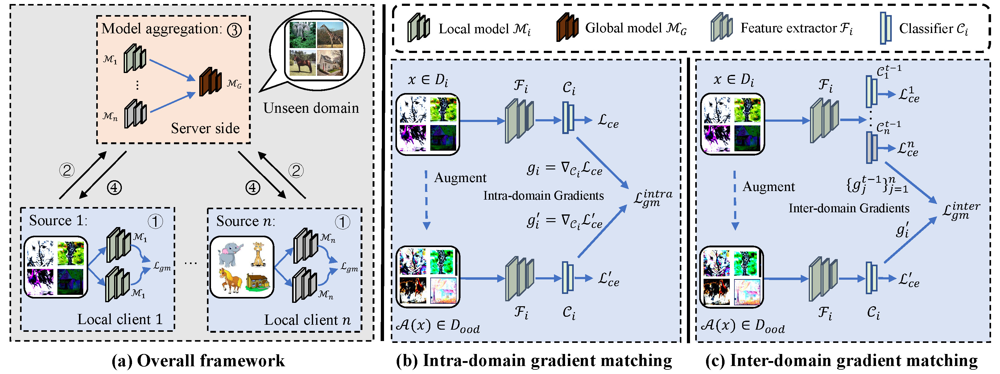
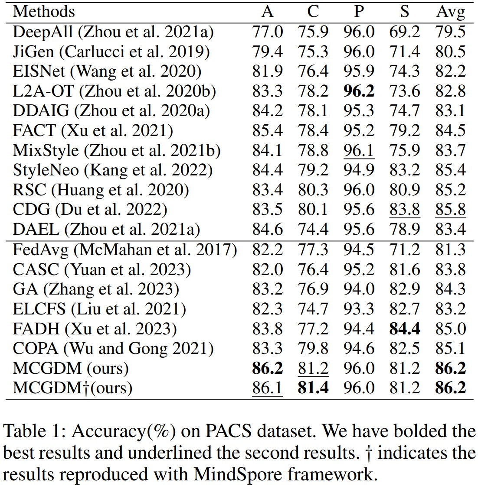

# Multi-Source Collaborative Gradient Discrepancy Minimization for Federated Domain Generalization
Here is the official implementation of the model `MCGDM` in paper ["Multi-Source Collaborative Gradient Discrepancy Minimization for Federated Domain Generalization", AAAI 2024]().

## Different setups of domain generalization

  

* Domain Generalization (DG) assumes that the data from multiple source domains can be accessed simultaneously to learn a generalizable model for deployment on the unseen domain.
* Federated Domain Generalization (FedDG) assumes that the data from different source domains are decentralized, but the local models of different domains can be collaboratively trained and aggregated with a parameter server.
* Federated Domain Adaptation (FedDA) assumes that an additional unlabeled target domain can be accessed on server side for improving the performance.

## Method

  

* (1) Collaborative train the decentralized domains: Due to the data from different domains are decentralized, we utilize the federated learning framework, e.g. FedAvg to collaborative train the multiple decentralized source domains.
* (2) Gradient discrepancy indicates the domain-specific information: Inspired by the hypothesis that the gradient discrepancy between domains indicates the model updating to be domain-specific, we utilize the gradient discrepancy to detect the domain shift.
* (3) Reducing the domain shift under the data decentralization scenario: Under the data decentralization scenario, we propose to learn the intrinsic semantic information within isolated domain and reduce the domain shift between decentralized domains by reducing the gradient discrepancy within domain and across domains.

### Install Datasets
Please prepare the PACS dataset.
```
base_path
│       
└───dataset
│   │   pacs
│       │   images
│       │   splits
```
<!-- Our framework now support four multi-source domain adaptation datasets: ```DigitFive, DomainNet, OfficeCaltech10 and Office31```. -->

<!-- * PACS

  The PACS dataset can be accessed in [Google Drive](https://drive.google.com/file/d/1QvC6mDVN25VArmTuSHqgd7Cf9CoiHvVt/view?usp=sharing). -->

### FedDG
The configuration files can be found under the folder  `./config`, and we provide four config files with the format `.yaml`. To perform the FedDG on the specific dataset (e.g., PACS), please use the following commands:

```python
CUDA_VISIBLE_DEVICES=0 python main_dg.py --config PACS.yaml --target-domain art_painting -bp ../

CUDA_VISIBLE_DEVICES=0 python main_dg.py --config PACS.yaml --target-domain cartoon -bp ../

CUDA_VISIBLE_DEVICES=0 python main_dg.py --config PACS.yaml --target-domain photo -bp ../

CUDA_VISIBLE_DEVICES=0 python main_dg.py --config PACS.yaml --target-domain sketch -bp ../

```

The ./model_ckpt for PACS dataset can be downloaded in Baidu Yun:

Link: https://pan.baidu.com/s/15qef8IGGHJrIgCwvh0Fntg

Code: pesb 

The results on PACS dataset for FedDG task is as follows.

  

## Reference

If you find this useful in your work please consider citing:
```

```

## Acknowledgments
The [MindSpore version](https://gitee.com/luckyyk/fedgm) is implemented by [Li Deng](https://tjumm.github.io/team/), thanks very much.
